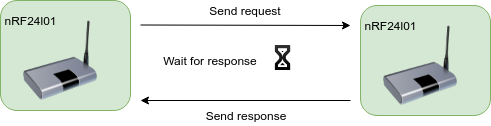

# ConnectorRF24 documentation

blabla..

## Overview


## Work modes

## Communication

### Exchange data between RF24l01 connectors.



#### Data format

Data frame exchanged between two connectors has specific format. All parts of requests and responses are divided by "@" sign. 

Main data frame is following:

```json
@{operation}@{direction}@{data}@
```

Where:

- {operation} - name of operation which will be executed,
- {direction} - two possibilities: 
  - "req" - request, 
  - "res" - response,
- {data} - content of message.

Main response data frame is following:

```
@{operation}@{direction}@{state}@{data}@
```

Additional parameter is {state} which is interpreted like:

- "ok" - execution of request was successful,
- "err" - error occurred during executing request

Here are following operations:

- passData - data are sent in special format frame as request to another device. this request is used for pass data between devices connected to nRF connectors.

  ```json
  @sendData@req@ThisIsExampleOfContent@
  ```

  If requests is processed without any errors then response is sent back:

  ```json
  @sendData@res@ThisIsExampleOfResponse@
  ```


### Exchange data between RF24l01 connector and external devices

#### UART

blabla


##### asdasd

##### asdasd


